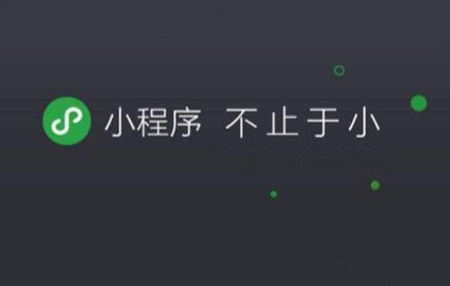
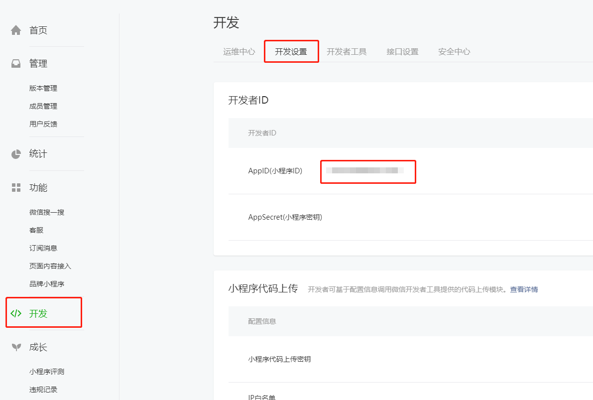
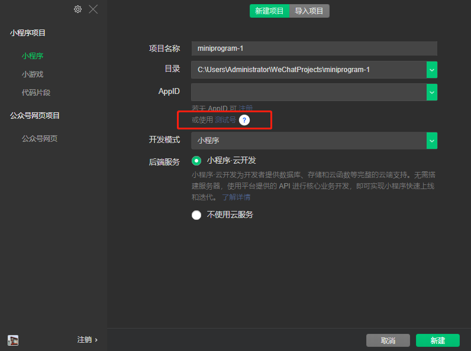
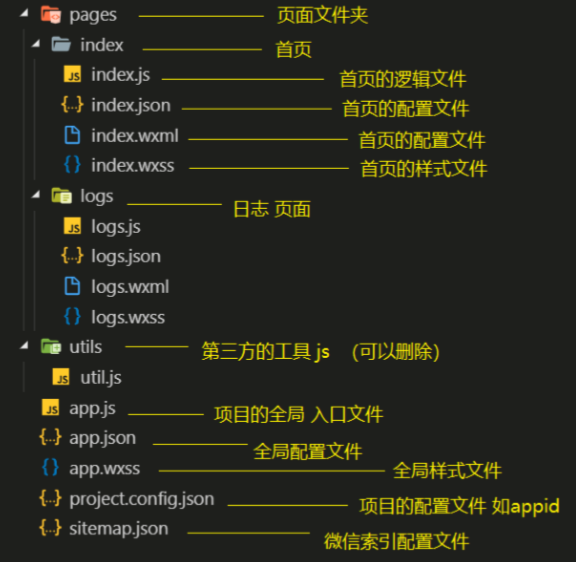

## 微信小程序入门介绍

>微信小程序，简称小程序，英⽂名 Mini Program Mini Program ，是⼀种不需要下载安装即可使⽤的应⽤，它实现 了应⽤“触⼿可及”的梦想，⽤⼾扫⼀扫或搜⼀下即可打开应⽤

## 1. 微信小程序的简介和开发工具

### 1.1 为什么是微信小程序

1. 微信有海量⽤户，⽽且粘性很⾼，在微信⾥开发产品更容易触达⽤⼾； 
2. 推⼴app或公众号的成本太⾼。 
3. 开发适配成本低。
4. 容易小规模试错，然后快速迭代。 
5. 跨平台。

### 1.2  微信小程序历史 
2016年1⽉11⽇，微信之⽗张小⻰时隔多年的公开亮相，解读了微信的四⼤价值观。张小⻰指出， 越来越多产品通过公众号来做，因为这⾥开发、获取⽤⼾和传播成本更低。拆分出来的服务号并没 有提供更好的服务，所以微信内部正在研究新的形态，叫「微信小程序」需要注意的是，之前是叫 做应⽤号 

2016年9⽉21⽇，微信小程序正式开启内测。在微信⽣态下，触⼿可及、⽤完即⾛的微信小程序引 起⼴泛关注。腾讯云正式上线微信小程序解决⽅案，提供小程序在云端服务器的技术⽅案。

2017年1⽉9⽇，微信推出的“小程序”正式上线。“小程序”是⼀种⽆需安装，即可使⽤的⼿ 机“应⽤”。不需要像往常⼀样下载App，⽤⼾在微信中“⽤完即⾛”。

###  1.3  疯狂的微信小程序 
1. 微信⽉活已经达到10.82亿。其中55岁以上的⽤⼾也达到6300万 
2. 信息传达数达到450亿，较去年增⻓18%;视频通话4.1亿次,增⻓100% 
3. 小程序覆盖超过200+⾏业，交易额增⻓超过6倍，服务1000亿+⼈次,创造出了5000亿+的商业价值

###   1.4.  还有其他的小程序不容忽视
1. ⽀付宝小程序 
2. 百度小程序 
3. QQ小程序 
4. 今⽇头条
5. 抖⾳小程序

### 1.5  开发准备和第一个项目

1. 注册账号(建议使用全新的邮箱，没有注册过其他小程序或者公众号的)

   [小程序注册 ](https://mp.weixin.qq.com/wxopen/waregister?action=step1&amp;token=&amp;lang=zh_CN )

2. 获取APPID 

   [登陆地址](https://mp.weixin.qq.com/)
   
   >由于后期调⽤微信⼩程序的接⼝等功能，需要索取开发者的⼩程序中的 APPID APPID ，所以在注册成功后， 可登录，然后获取APPID。

3.  下载开发工具

   >微信⼩程序⾃带开发者⼯具，集开发、预览、调试、发布、于⼀⾝的完整环境。
   >但是由于编码的体验不算好，因此建议使⽤vs code 微信小程序编辑工具 微信小程序编辑工具来实现编码
   >vs code 负责敲代码， 微信编辑工具   微信编辑工具 负责预览

4. 使用微信开发者工具创建项目 第一次使用需要扫码 APPID可以先使用测试号

5. 小程序的目录结构简介

> 小程序框架的⽬标是通过尽可能简单、⾼效的⽅式让开发者可以在微信中开发具有原⽣APP体验的服 务。小程序框架提供了⾃⼰的视图层描述语⾔  WXML WXSS ，以及JavaScript ，并在视图层与逻 辑层间提供了数据传输和事件系统，让开发者能够专注于数据与逻辑

**小程序和其他项目的对比**

|      | 传统web    | 微信⼩程序 |
| ---- | ---------- | :--------: |
| 结构 | HTML       |    WXML    |
| 样式 | CSS        |    WXSS    |
| 逻辑 | Javascript | Javascript |
| 配置 | ⽆         |    JSON    |

**小程序的目录结构简介**

